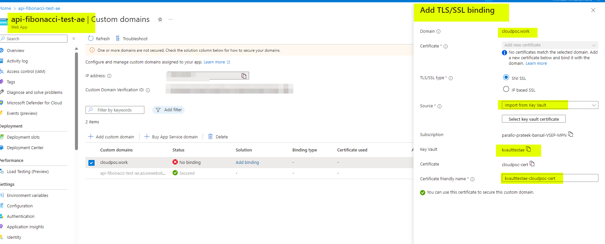

# Fibonacci API on Azure

This repository contains the source code for a Python-based Fibonacci API, which is deployed across multiple environments (dev, test, stage, prod) on the Azure platform using Infrastructure as Code (IaC) with Terraform.

## API Overview

The Fibonacci API accepts an integer `n` as input and returns the nth Fibonacci number. The sequence starts from F(0) = 0, F(1) = 1, and follows the formula F(n) = F(n-1) + F(n-2) for n > 1.

### Example Usage

- `GET /fibonacci?n=2` returns `1`
- `GET /fibonacci?n=10` returns `55`

## Project Structure

- `/src`: Contains the source code of the Fibonacci API.
- `/iac`: Contains the Terraform configurations for infrastructure setup.
- `/.github`: Contains build and environment-specific pipeline.

## Infrastructure and Deployment

The application is containerized using Docker and deployed to a Linux Web App on Azure, leveraging Azure Container Registry for image storage. Infrastructure setup and environment management utilize Terraform workspaces to maintain isolation between dev, test, stage, and prod environments.

### Key Components

- **Azure App Service**: Hosts the web app on a Linux environment.
- **Azure Container Registry (ACR)**: Stores the Docker images.
- **Azure Key Vault**: Manages SSL certificates and other secrets.
- **Application Insights and Log Analytics**: For monitoring and logging.

## Getting Started

### Prerequisites

- Azure CLI installed on your local machine. - This step is must to deploy shared infrasturcure or either you can deploy this script directly from the Azure portal CLI
- Proper Azure role assignments (Contributor and User Access Administrator) on your subscription.

### Setup Steps
## Terraform State Management

We have implemented a robust approach to manage the Terraform state to ensure safety and prevent accidental changes or deletions:

- **Storage Account:** The Terraform state is stored in a storage account that is **not provisioned or managed via Infrastructure as Code (IaC)**. This decision is strategic and aims to safeguard the state file from accidental modifications that could occur through automated processes.

- **Purpose:** By keeping the Terraform state in a separately managed storage account, we mitigate the risk of inadvertent disruptions or catastrophic deletions during routine IaC operations. This layer of separation helps maintain the integrity of our deployment environments and ensures consistent deployment practices.

This setup is crucial for maintaining a stable and reliable infrastructure, where changes are controlled, and state management is secured against unintended alterations.

1. **Deploy Shared Resources**: Run the script `sharedResourceDeployment.sh` locally to deploy resources like ACR that is shared across environments.

2. **Branching and Deployment Strategy**

Due to limitations with environment availability in private repositories, I've implemented a specific branch logic for our deployment process:

- **Feature Branches:** For any feature branch, if someone pushes the code, the Terraform `apply` command will be executed for all four environments: `test`, `dev`, `stage`, and `prod`.

- **Main Branch:** If we merge the feature branch code into the main branch, Terraform will run the `apply` command for the `dev`, `test`, and `stage` environments, **excluding** the `prod` environment. This ensures that production deployment requires explicit approval and separate handling.

- **Release Branch:** A new branch called `release` has been created specifically for production deployments. When a pull request is merged from `main` into `release`, only the `prod` deployment will occur. This branch serves as the final gate for production changes, ensuring that only fully vetted and approved changes are deployed to our production environment.

This setup helps maintain control and staging of changes across different environments, providing a structured pathway from development to production.

   > ## Important Note on GitHub Actions and Environments
    > 
    > You might wonder why I haven't used environments, which could act as gates for manual approval for production deployment. Actually, I haven't worked much with GitHub Actions but wanted to take this as challenge and have mainly worked on Azure DevOps. Initially, I started writing code in a private repository and searched the GitHub Actions documentation for environments. There was a document regarding that, but I couldn't see that option because I was working in the private repo.
    >
    > When I pushed my test code into the public repo, which I shared the link with you, then I realized environments are not available for private repositories. I was out of time and decided not to make any changes to the code.

3. **Configure GitHub Secrets**:
   - Use `az ad sp create-for-rbac` to create a service principal with the appropriate roles.
   - Store credentials like Azure service principal details and Docker credentials in GitHub Secrets.
   - Refer to [Azure GitHub Actions documentation](https://learn.microsoft.com/en-us/azure/developer/github/connect-from-azure?tabs=azure-portal%2Clinux#use-the-azure-login-action-with-a-service-principal-secret) for more details.

4. **Build and Push Docker Images**:
   - Run the `application-build-pipeline.yml` to build the Docker image and push it to ACR.

5. **Domain and SSL Configuration (manual steps)** :
   - If using a custom domain, configure DNS records (A and TXT) on Cloudflare.
   
   
   
   

   - Retrieve and apply SSL certificates via Azure Key Vault.

## Testing

Once deployed, access the API via the provided Azure Web App URL or your configured custom domain. You can test of these below urls. 

- (https://api-fibonacci-test-ae.azurewebsites.net/fibonacci?n=10)
- (https://cloudpoc.work/fibonacci?n=10)

## Additional Resources

- For further enhancements and infrastructure improvements, refer to the additional READMEs in this repository.
